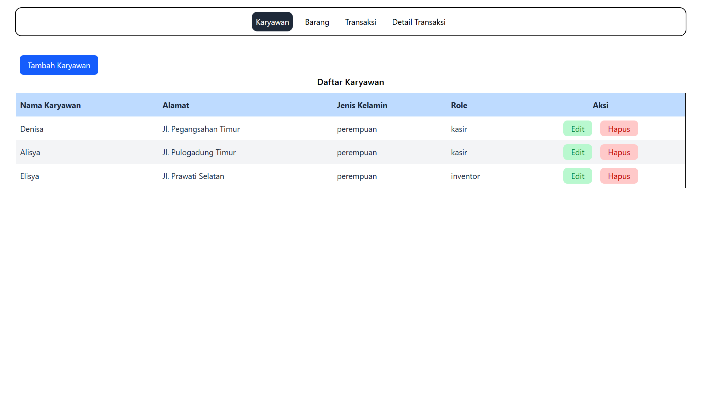
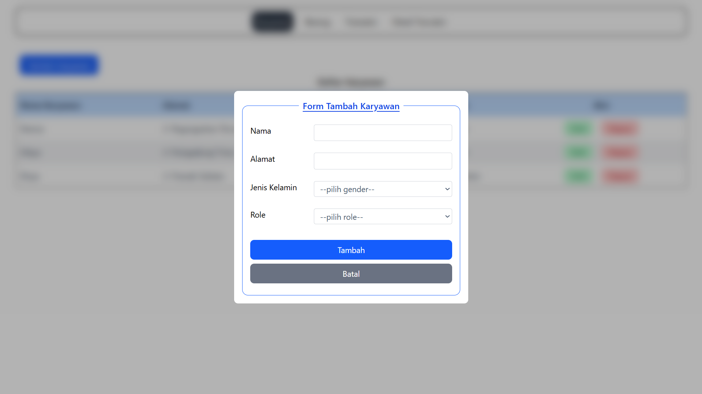
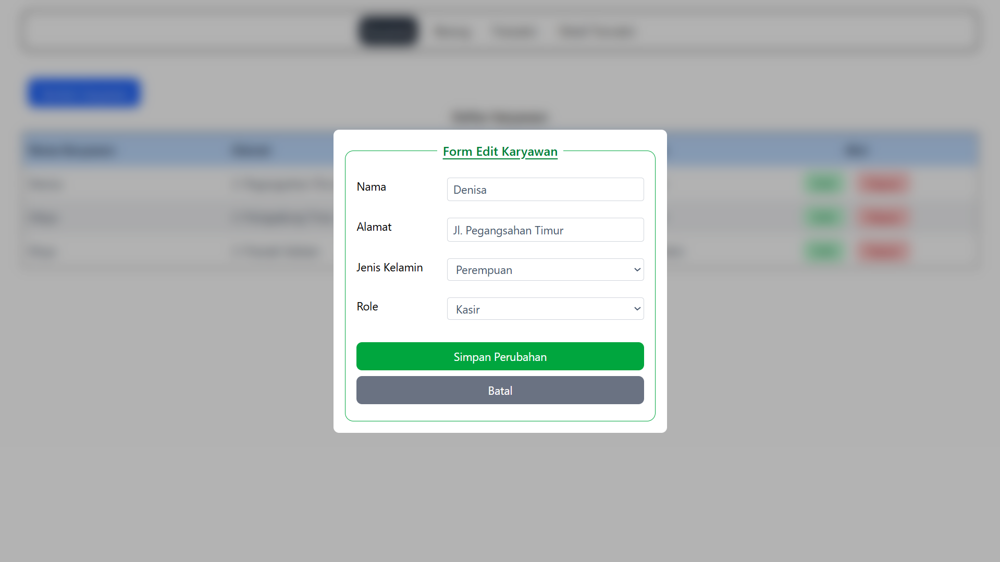

## ⚙️ Tech Stack
1. 🐘 PHP (MVC OOP)
2. 🛢️ MySQL
3. ✨ JavaScript
4. 🎨 TailwindCSS
5. 🍬 SweetAlert

---

##  📁 Struktur Folder
```bash
├── assets/
│   ├── screenshots/
│   │   └── tabel-karyawan.png
│   │   └── tambah-karyawan.png
│   │   └── edit-karyawan.png
├── config/       
│   └── routes.php     
│   └── database.php
├── controllers/
│   └── BarangController.php
│   └── karyawanController.php
│   └── TransaksiController.php
│   └── DetailTransaksiController.php
├── models/
│   └── BarangModel.php
│   └── karyawanModel.php
│   └── TransaksiModel.php
│   └── DetailTransaksiModel.php
├── views/
│   ├── layouts/
│   │   └── navbar.php
│   ├── karyawan/
│   │   └── index.php
│   │   └── proses_add.php
│   │   └── proses_edit.php
│   │   └── proses_delete.php
├── db_kasir.sql
```

---

## 📸 Preview Tampilan

### A. Menu Karyawan
#### 1. Data Karyawan

#### 2. Form Tambah Karyawan

#### 3. Form Edit Karyawan

